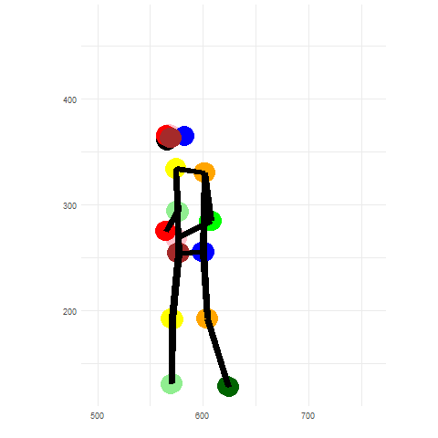
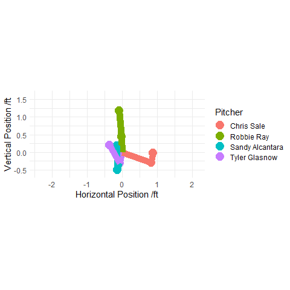

# PitcherMotion
Pose tracking data for baseball pitchers

##### Contains:
ReadMe.md - A short overview of the data and how to use it

Example_Script.R - A script with examples of how to use the data

## Data Overview:

The data can be found at the following dropbox link:
https://www.dropbox.com/sh/gxxxnqu9c1v0d6w/AAA8Ilsel7YB3_uYn03_k7Vba?dl=0

The main file is Pitcher_Motion_Data.csv. This is a csv file of about 500 MB.

There is also a companion csv file which contains Statcast data corresponding to the pitches which are included in this dataset.

Data was taken for pitchers/pitch types which had been thrown at least 5 times at Tropicana Field in the 2021 regular season. 5 sample videos were used for each pitch, in each case these were the last thrown by the particular pitcher.

Tropicana field was used because it has a centerfield camera angle which is easy to work with. Only limited data is included due to the volume of computation required to measure pitcher positions.

Each individual pitch can be uniquely identified by using three columns:
1. "pitcher" - An integer, The MLBid of the pitcher
2. "pitch_type" - A string representing the type of pitch thrown, as classified by Statcast
3. "pitch_id" - An integer from 1 to 5, representing which number in the sample this pitch is

The column "normalised_frame" contains the time variable for the pitch, measured in video frames (The video is 60fps). This is zeroed at the leg lift of the pitcher and extends in both the positive and negative directions.

Detection of the pitcher was done automatically based on their position in the frame, the synchronisation of the pitches was performed automatically by using the pitcher's leg lift. There may be cases where this process failed because the pose tracking algorithm didn't identify the pitcher, or some part of the pitcher's motion wasn't seen in the highlight video. I included two reliability flags to show when this process failed. 

"no_missing_frames" = 1 when the pitcher can be observed continuously from normalised_frame = -20 to +120, otherwise there may be frames in this time period where the pitcher was not detected and is therefore missing from the dataset. "smooth_CoM_flag" = 1 when the pitcher's torso position does not vary by more than 100 pixels between consecutive frames, this removes cases where different players may be detected as the pitcher. Filtering by both of these columns gives the most robust set of movement data.

Columns V1 to V51 describe the positions of the pitcher's body parts in pixels. Each body part is described by three columns, the horizontal and vertical coordinates are the first two, I'm not sure what the third is but I've left it in the dataset. The order is always left first then right, moving down along the body

V1-V15 are points on the head

V16-V21 are the shoulders

V22-V27 are the elbows

V28-V33 are the hands

V34-V39 are the hips

V40-V45 are the knees

V46-V51 are the feet

The vertical components are the number of pixels from the *top* of the image, so you need to take (720 - variable) of these to get the correct position on the image.

There are also some other variables which are left over from the pitcher identification, and also a variable containing a rudimentary attempt to measure hip/shoulder separation from this 2D data, this is not a reliable measurement!

##### Example_Script.R is an R script which shows how to use this data in some simple examples

## Acknowledgements:

Thanks to [baseballsavant](https://baseballsavant.mlb.com) and MLB for making video highlights easily available online, which was essential to collect data on this scale.

Also thanks to Will McNally for KAPAO, all pose detection was done using this algorithm, implemented in python. 

[https://github.com/wmcnally/kapao](https://github.com/wmcnally/kapao)

This is a type of dataset which has not been publicly available before, I hope some use can be found for it.

If you have any suggestions get in touch on Twitter @Pitching_Bot, or find my contact information at [my website](https://www.pitchingbot.com/)

Cameron Grove - 24/12/21
